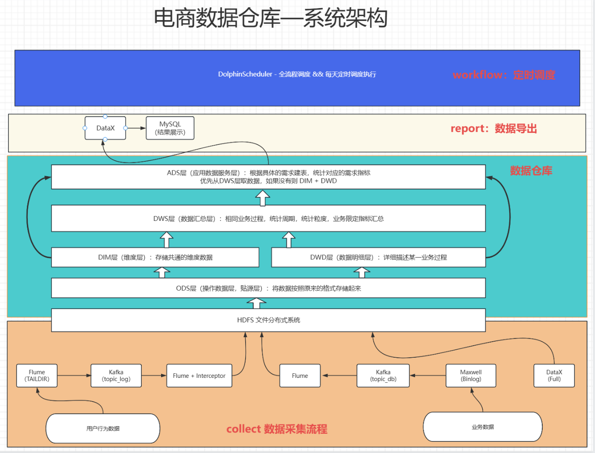

# 系统整体架构

## 概述

GMall 离线数据仓库系统采用经典的 **Lambda 架构**思想，以**离线批处理**为核心，构建从数据采集到数据应用的完整数据链路。系统整体分为四大层级：

1. **数据采集层** — 负责用户行为日志和业务数据的采集与同步
2. **数据存储层** — HDFS 分布式文件系统存储原始及加工数据
3. **数据计算层** — Hive on Spark 进行分层 ETL 计算
4. **数据应用层** — 报表、大屏等业务出口

## 整体架构图

### 数据采集通道

## 集群部署规划

| 节点 | 组件 | 角色 |
|------|------|------|
| **hadoop102** | NameNode, ResourceManager, Hive Metastore/Server2, Kafka, ZK, Maxwell, Flume, DolphinScheduler Master/Worker | 主管理节点 |
| **hadoop103** | DataNode, NodeManager, Kafka, ZK, Flume, DolphinScheduler Worker | 计算节点 |
| **hadoop104** | DataNode, NodeManager, SecondaryNameNode, Kafka, ZK, Flume, DolphinScheduler Worker | 计算节点 |

## 技术选型依据

| 技术点 | 方案 | 选型理由 |
|--------|------|----------|
| **计算引擎** | Hive on Spark | 保留 Hive SQL 易用性，Spark 替换 MR 提升性能 |
| **采集通道** | Flume → Kafka → Flume | Kafka 作为中间缓冲层，解耦采集端与消费端 |
| **CDC 工具** | Maxwell | 轻量级，原生支持 Kafka，配置简单 |
| **全量同步** | DataX | 阿里开源，异构数据源支持广泛，性能稳定 |
| **调度系统** | DolphinScheduler | 分布式 DAG 调度，可视化操作，运维友好 |
| **部署方式** | Apache 原生 | 灵活可控，适合学习和小规模部署 |
