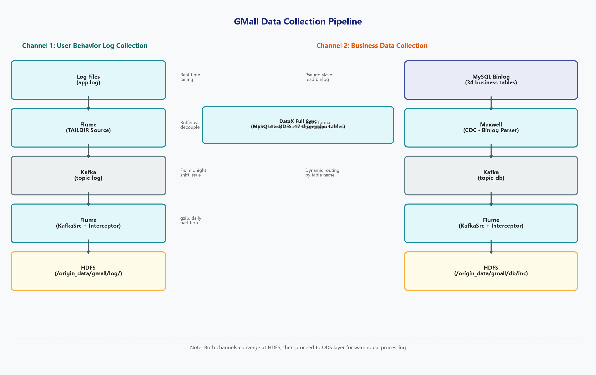

# 数据采集流程

## 概述

数据采集是整个数据仓库的数据入口，负责从两个核心数据源获取原始数据：

1. **用户行为日志** — 用户在电商平台上的浏览、点击、下单等行为数据
2. **业务数据库** — MySQL 中存储的 34 张业务表（订单、商品、用户等）

---

## 一、用户行为日志采集

### 1.1 数据格式

用户行为日志为 JSON 格式，包含以下核心结构：

```json
{
  "common": { },     // 环境信息（设备、渠道、版本等）
  "page": { },       // 页面信息
  "actions": [ ],    // 动作（事件）列表
  "displays": [ ],   // 曝光列表
  "err": { },        // 错误信息
  "ts": 1585744374423 // 时间戳
}
```

日志类型分为**页面日志**和**启动日志**两类。

### 1.2 采集流程



**用户行为日志采集详细流程：**

```
日志文件 (app.log)
    │
    ▼
Flume (TAILDIR Source)
    │  实时监控日志文件增量
    ▼
Kafka (topic_log)
    │  消息缓冲与解耦，避免峰值冲击 HDFS
    ▼
Flume (Kafka Source + TimestampInterceptor)
    │  · 拦截器解决零点漂移问题
    │  · 将 Header 时间戳替换为 Body 中的业务时间戳
    ▼
HDFS (/origin_data/gmall/log/topic_log/%Y-%m-%d)
    · 按日分区存储
    · gzip 压缩
    · 文件前缀: log
```

### 1.3 关键配置

**上游 Flume — 日志文件到 Kafka**

```properties
a1.sources.r1.type = TAILDIR
a1.sources.r1.filegroups.f1 = /opt/module/applog/log/app.*
a1.channels.c1.type = org.apache.flume.channel.kafka.KafkaChannel
a1.channels.c1.kafka.topic = topic_log
```

**下游 Flume — Kafka 到 HDFS**

```properties
a1.sources.r1.type = org.apache.flume.source.kafka.KafkaSource
a1.sources.r1.kafka.topics = topic_log
a1.sources.r1.interceptors.i1.type = com.lijingang.gmall.flume.interceptor.TimestampInterceptor$Builder
a1.sinks.k1.type = hdfs
a1.sinks.k1.hdfs.path = /origin_data/gmall/log/topic_log/%Y-%m-%d
a1.sinks.k1.hdfs.fileType = CompressedStream
a1.sinks.k1.hdfs.codeC = gzip
```

### 1.4 零点漂移问题与解决方案

**问题描述**：Flume 写入 HDFS 时默认使用系统时间作为分区依据。如果数据在接近凌晨时产生，可能出现"数据时间属于前一天，但 Flume 在零点之后才处理，导致落入后一天分区"的问题。

**解决方案**：自定义 `TimestampInterceptor` 拦截器，解析 JSON Body 中的 `ts` 字段，将其写入 Event Header 的 `timestamp` 字段，Flume 的 HDFS Sink 使用该 timestamp 进行分区，确保分区日期与业务时间一致。

---

## 二、业务数据采集

### 2.1 业务表概览

MySQL 中模拟的 GMall 电商业务数据包含 34 张表，按变更频率分为两类：

**配置维度表（全量同步）**：数据量小、变化少，每日全量快照
- activity_info, activity_rule, base_category1/2/3, base_dic, base_province, base_region, base_trademark, coupon_info, sku_attr_value, sku_info, sku_sale_attr_value, spu_info, promotion_pos, promotion_refer

**事实/状态表（增量同步）**：数据量大、变化频繁，增量采集
- comment_info, coupon_use, favor_info, order_detail, order_detail_activity, order_detail_coupon, order_info, order_refund_info, order_status_log, payment_info, refund_payment, user_info
- cart_info（特殊：同时拥有全量与增量两张 ODS 表）

### 2.2 增量采集流程（Maxwell）

Maxwell 增量采集通道如下：

### 2.3 Maxwell 原理

Maxwell 通过**伪装成 MySQL Slave**，读取主库的 Binary Log，将数据变更实时转换为 JSON 格式输出到 Kafka。其核心机制与 MySQL 主从复制一致：

1. Master 将数据变更写入 Binlog
2. Maxwell（伪装 Slave）从 Master 同步 Binlog 事件
3. Maxwell 解析 Binlog 事件，生成 JSON 消息发送到 Kafka

### 2.4 全量同步流程（DataX）

DataX 全量同步适用于配置维度表，将 MySQL 中的 17 张表通过 SQL 查询全表数据后写入 HDFS，支持日期参数 `-Ddt` 动态分区。数据以 `\t` 分隔、gzip 压缩，按日期分区存储。

### 2.5 数据同步策略

| 同步策略 | 适用场景 | 优点 | 缺点 |
|----------|----------|------|------|
| **全量同步** | 小数据量维度表 | 逻辑简单，开发维护成本低 | 大数据量时效率低 |
| **增量同步** | 大数据量事实表 | 效率高，不重复存储 | 需要首日全量初始化，逻辑复杂 |

---

## 三、采集通道启停

### 一键启停

```bash
# 启动所有采集通道
caiji_cluster.sh start

# 停止所有采集通道
caiji_cluster.sh stop
```

### 启停顺序

**启动顺序**（从底层到上层）：
1. ZooKeeper → 2. Hadoop(HDFS+YARN) → 3. Kafka → 4. Flume 采集端 → 5. Maxwell → 6. Flume 消费端

**停止顺序**（从上层到底层）：
1. Maxwell → 2. Flume 采集端 → 3. Flume 消费端 → 4. Kafka → 5. Hadoop → 6. ZooKeeper
